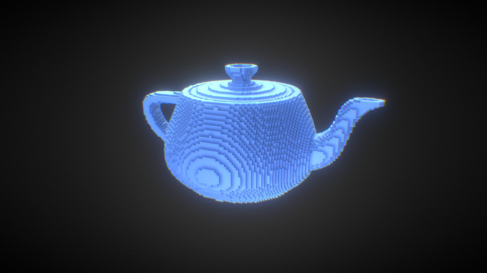
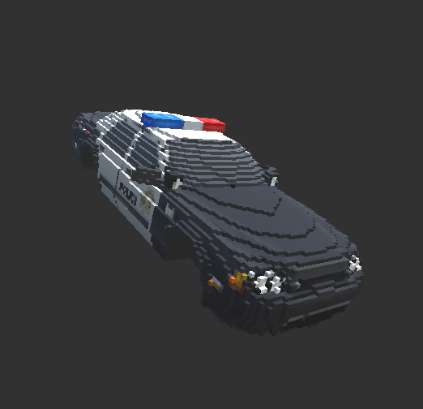
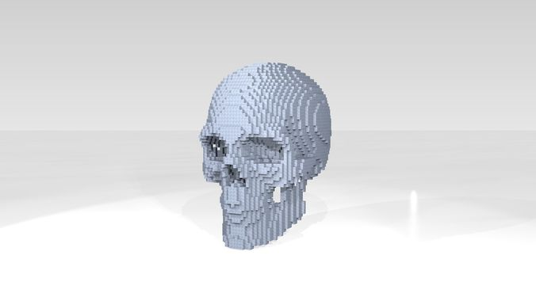

# VoxWise

[Link to this file on Github](https://github.com/magatha14/VoxWise/blob/main/proposal.md)

### Note to Instructors

I will be working on the Shader assignment for the official final project that my partner and I didn't implement for Assignment 3. 

If it's possible, I wanted to also submit this mesh project idea I had for feedback. If you all do have time to look, would you be able to treat it just like any other final project proposal? I won't be turning this one in for the final, but I want to be able to work on it on my own time after this class is over. 

## Who
_Maggie Wang (wangm8)_

## Summary

Voxel meshing is frequently used in medical imaging and has even established itself as an aesthetic in 3D art. I propose building my own implementation of a voxel mesh visualization from any polygonal mesh as an extension of Cardinal3D Assignment 2. After successful implementation of voxel remeshing, I will seek to improve rendering performance. Then, other additional features such as modifying the voxel mesh using boolean mesh operations and conversion of the voxel mesh back into the original polygonal mesh. I will use VoxWise to create aesthetically blocky meshes of various complicated models.

## Tasks

### Main Tasks

**Task 1:** Add a button to Cardinal3D interface that when clicked, will call a remesh function that repopulates the meshing data structures to recompute the voxel mesh of the object. I will be tracing the functionality of edit mesh button functions implemented previously like `Subdivision`

**Task 2:** Implement [Marching Cube Algorithm](https://en.wikipedia.org/wiki/Marching_cubes#:~:text=Marching%20cubes%20is%20a%20computer,which%20are%20sometimes%20called%20voxels) to create a voxel mesh

Other helpful links:
* https://github.com/pmneila/PyMCubes 
* https://www.cs.carleton.edu/cs_comps/0405/shape/marching_cubes.html
* https://graphics.stanford.edu/~mdfisher/MarchingCubes.html

### Additional Tasks

**Task 3 (Extra):** Implement [sparse voxel octree](https://en.wikipedia.org/wiki/Sparse_voxel_octree) to efficiently compute meshes allowing for different sized voxels. In other words, areas with less detail will utilize larger cubic units, and areas with more detail will utilize smaller cubic units. See images for visuals of what this looks like

Other helpful links:
* https://eisenwave.github.io/voxel-compression-docs/svo/svo.html

**Task 4 (Extra):** Implement boolean mesh operations, particularly add and subtract. [See slides 31+](https://www.cs.cmu.edu/~scoros/cs15869-s15/lectures/05-CSG_Procedural.pdf)

**Task 5 (Extra):** Convert Voxel mesh back to non-voxel mesh. This can be implemented using Marching Cube Algorithm.

## Expected Visual Deliverables

